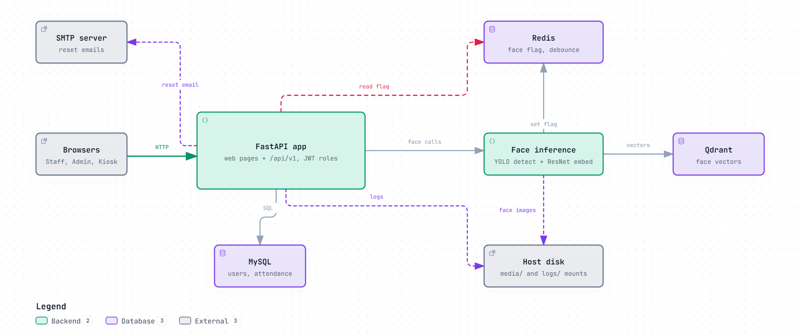

# Staff Attendance System

## Architecture



Interactive version (zoom, search, trace a path, export): open [docs/architecture.html](docs/architecture.html) in a browser. The editable source is [docs/architecture.diagram.json](docs/architecture.diagram.json).

- **One entry point.** Staff, admin and kiosk browsers talk only to the FastAPI app, which serves the web pages and `/api/v1`. It is the only service Docker Compose publishes (`APP_PORT`).
- **Face inference runs inside the app.** It is mounted at `/api/v1/inference`. It detects and embeds faces, and stores and searches the vectors in Qdrant.
- **Attendance gating.** After a face is recognized, the inference service sets a short-lived flag in Redis. The app reads and consumes it before saving a check-in or check-out. The kiosk only records after the person confirms.
- **Private services.** MySQL (users, departments, attendance events), Redis and Qdrant sit on an internal Docker network with no host ports.
- **Outside the containers.** Enrolled face images (`MEDIA_HOST_DIR`) and logs (`LOG_HOST_DIR`) live on the host disk. Password-reset emails go out through the configured SMTP server.

## User management API

FastAPI + MySQL (`api/`, `database/`). Roles: `admin` (everything), `staff` (own data only), `system` (the kiosk machine: only `kiosk_scan`, no attendance of its own; see `ROLE_PERMISSIONS` in `api/deps.py`).

```bash
cp .env.example .env            # set real secrets (JWT_SECRET_KEY, MYSQL_*), SMTP_* for production
docker compose up -d --build    # app + MySQL + Redis + Qdrant (see "Docker deployment")
docker compose exec app python -m api.cli create-admin --email admin@example.com --name "Admin"
```

Without Docker for the app itself (databases must be reachable from the host, see "Local development"):

```bash
uv run alembic upgrade head
uv run python -m api.cli create-admin --email admin@example.com --name "Admin"
uv run uvicorn api.main:app --host 0.0.0.0 --port 8000
uv run pytest
```

Endpoints under `/api/v1` (Swagger at `/docs` when `APP_ENV=development`):

| Method | Path | Access |
|---|---|---|
| POST | `/auth/login` (username or email) | public |
| POST | `/auth/signup` | public (staff user name, employee id, department, email, password; `SIGNUP_ENABLED`) |
| POST | `/auth/forgot-password`, `/auth/reset-password` | public (emailed single-use token) |
| GET | `/departments` | public (sign-up dropdown) |
| POST / PUT / DELETE | `/departments`, `/departments/{id}` | admin (`{code, name}`; delete blocked while users are assigned) |
| GET / POST | `/face/enrollment`, `/face/enroll` | staff, admin (checks MySQL + Qdrant for an existing enrollment/face, then ingests) |
| POST / GET | `/users` | admin (create / list) |
| GET | `/users/me` | any user |
| GET | `/users/{id}` | admin or self |
| POST | `/users/{id}/activate`, `/users/{id}/deactivate` | admin |
| DELETE | `/users/{id}` | admin |
| PUT | `/users/{id}/password` | self (needs `current_password`) or admin |

`APP_ENV=production` refuses to start with weak/placeholder secrets, console email, or wildcard CORS, and disables `/docs`.

**Web page:** `GET /` serves the login / sign-up / reset-password page. After sign-up (or login without enrolled face) a consent dialog precedes the webcam capture, which posts to `/face/enroll`. Set `FRONTEND_URL` to the API's public URL so reset emails link to `/reset-password?token=...`.

**Inference service** is mounted at `/api/v1/inference/*` (health, `/ws/stream/{id}?token=<jwt>`, recognize, testing...). Admins may call everything; other users only the live stream and health.

Seed departments (idempotent, matched by code): `uv run python -m api.cli seed-departments 247=AIML "002=CSE(CY)"`

**Admin console:** logging in as an admin on `/` redirects to `/admin` (Overview with counters and recent check-ins/outs, Users, Departments, Attendance daily summaries and raw events). It is only a shell; every call is authorized by the API (`GET /api/v1/admin/summary` is admin-only). The token lives in `sessionStorage`, so closing the tab logs out.

**Staff portal:** logging in as a staff user on `/` (once face recognition is set up) redirects to `/portal`: today's status (checked in/out, first check-in, last check-out, hours), and a report for Today / This week / Last week / This month / Last month / a custom range, with days present, total and average hours, average check-in time, missing check-outs, and a per-day table. It reads only `GET /attendance/me/today` and `GET /attendance/me`, which return the caller's own data and nothing else. Times are shown in `APP_TIMEZONE`; "today" and the week/month boundaries come from the server's date (weeks start on Monday). Hours are first check-in to last check-out; a day without a check-out is flagged "Missing check-out".

**Kiosk (`system` role):** create a user with role `system` (admin console → Users → Add user). Logging in as that user on `/` redirects to `/kiosk`, a camera-only page. Once one face has stayed in frame for 3 s it calls `POST /api/v1/kiosk/identify`, which recognizes the face but **records nothing**, and a confirm window shows the person's name/department with **Check in** / **Check out** buttons (only the valid one is enabled) and a close **X**. Pressing a button calls `POST /api/v1/kiosk/record` with the `match_token` from `/identify` (a signed token valid for 2 minutes, bound to that kiosk account) and the chosen `action`, then the page shows the check-in (green) or check-out (red) animation and a greeting. Pressing **X** (or the 20 s timeout) closes the window and nothing is logged, so a wrongly recognized person is never recorded. Other outcomes get their own message: `unknown` (face not registered or account inactive: "Oops! ... contact <admin name>"), `already_checked_in` / `not_checked_in`, `expired`, `no_face` (retried 3 times) and service unavailable. `POST /kiosk/detect` only counts faces. There is no liveness check, so a photo of a person can be recognized. The kiosk needs the inference models and Qdrant available.

### Attendance

Check-in / check-out events are stored append-only (`attendance_events`); the user-facing view is the day's **first check-in** and **last check-out**, admins see every event.

Face gating: the inference service writes `face_verified:<user_id>` to Redis (TTL `FACE_VERIFY_TTL`) whenever it recognizes a face. The face identity registered in Qdrant (`emp_id`) **must be the user's id**. `GET /attendance/me/status` returns `can_check_in` / `can_check_out` for the UI buttons, and the POST endpoints re-check the flag server-side and consume it (one recognition = one action).

| Method | Path | Access |
|---|---|---|
| GET | `/attendance/me/status` | any user (button state, today's first-in/last-out) |
| GET | `/attendance/me/today` | any user (own today: first-in/last-out, currently checked in; no Redis needed) |
| POST | `/attendance/check-in`, `/attendance/check-out` | staff, admin (needs verified face) |
| GET | `/attendance/me?date_from&date_to` | any user (own days: first in / last out) |
| GET | `/attendance/records?user_id&date_from&date_to` | admin (daily summaries with counts, all users) |
| GET | `/attendance/events?user_id&date_from&date_to` | admin (every raw event) |

Sequence is per work day (in `APP_TIMEZONE`): check-in is valid when not already checked in; check-out only after a check-in. A forgotten check-out leaves that day without a last check-out.

## Logging

Configured in `api/core/logs.py` and set up once at startup. Everything goes to stdout (so `docker logs` works) and to rotating files in `LOG_DIR`:

| File | Content |
|---|---|
| `app.log` | application and library logs (everything except access/audit) |
| `error.log` | `ERROR` and above only, with tracebacks |
| `access.log` | one line per HTTP request: method, path, status, `duration_ms`, client ip |
| `audit.log` | security-relevant events: `login_success`, `login_failed`, `signup`, `password_reset_*`, `password_changed`, `user_created/activated/deactivated/deleted`, `department_*`, `face_enrolled`, `kiosk_identify`, `kiosk_record`, `attendance_recorded` |

Settings: `LOG_LEVEL`, `LOG_FORMAT` (`auto` = JSON when `APP_ENV=production`, readable text otherwise), `LOG_DIR` (empty = console only), `LOG_MAX_BYTES`, `LOG_BACKUP_COUNT`. If `LOG_DIR` cannot be written the app keeps running on console logging and logs an error.

Every request gets an `X-Request-ID` (an incoming one is reused if it is 1-64 chars of `A-Za-z0-9._-`, otherwise a new one is generated). It is returned in the response header and included in every log line written while handling that request, so one id ties an access line, audit events and any error together. Query strings are never logged, and tokens, bearer headers and password fields are masked in all output (audit events carry ids and e-mails, never secrets). The console email backend is exempt so dev reset links stay clickable; it is blocked in production.

## Docker deployment

`docker compose up -d --build` starts four services: `app` (FastAPI + inference, built from `Dockerfile`), `mysql`, `redis` and `qdrant`. On start the app waits for the other three to be healthy, applies Alembic migrations and serves on port 8000 (one worker, because the rotating log files are not multi-process safe).

**Only the app is exposed**: `${APP_PORT}` (default 8000) on the host. The databases sit on an `internal` network with no host ports and no internet; the app is the only service also on the `edge` network (published port, model download, SMTP). Inside compose the app reaches them as `mysql`, `redis` and `qdrant` regardless of the `localhost` values in `.env`. The app container never receives `MYSQL_ROOT_PASSWORD`.

**Persistent directories**, all set in `.env` (relative paths are relative to the compose file):

| `.env` | Default | Holds |
|---|---|---|
| `MEDIA_HOST_DIR` | `./media` | enrolled face images: `<employee id>/images/image_N.jpg`, `<employee id>/img_N.jpg`, `profile_pics/<employee id>.jpg` |
| `LOG_HOST_DIR` | `./logs` | `app.log`, `error.log`, `access.log`, `audit.log` (+ rotated `.1`, `.2` ...) |
| `MYSQL_DATA_DIR`, `QDRANT_DATA_DIR`, `REDIS_DATA_DIR` | `./mysql_data`, `./qdrant_data`, `./redis_data` | database files |

The YOLO / VGGFace2 weights live in the `model_cache` named volume, so they are downloaded once and survive rebuilds.

Other build/run settings: `APP_PORT`, `APP_UID` / `APP_GID`, `TORCH_INDEX_URL` (the image installs CPU-only PyTorch by default; set it empty to get the CUDA wheels, and note GPU access additionally needs the NVIDIA container runtime and a `gpus` setting in the compose file).

On Linux, create `MEDIA_HOST_DIR` and `LOG_HOST_DIR` yourself and make them writable by `APP_UID:APP_GID` (the container runs as that non-root user), e.g. `mkdir -p media logs && sudo chown 1000:1000 media logs`; Docker would otherwise create them owned by root and the app exits with a "not writable" message. Rebuild after changing `APP_UID`.

Browsers only allow camera access on `https://` or `http://localhost`, so a kiosk or staff machine other than the server needs HTTPS in front of `APP_PORT` (a reverse proxy; set `FRONTEND_URL` to the public URL).

Useful commands:

```bash
docker compose logs -f app                      # console log stream
docker compose exec app python -m api.cli seed-departments 247=AIML "002=CSE(CY)"
docker compose down                              # stop (data dirs are kept)
```

### Local development

With the databases unpublished, `uv run uvicorn ...` on the host cannot reach them. Either run everything through compose, or add a git-ignored `docker-compose.override.yml` that publishes what you need on loopback:

```yaml
services:
  mysql:
    ports: ["127.0.0.1:3306:3306"]
  redis:
    ports: ["127.0.0.1:6379:6379"]
  qdrant:
    ports: ["127.0.0.1:6333:6333"]
```

(`networks.backend.internal` blocks published ports too, so also add `networks: { backend: { internal: false } }` to the override.)
